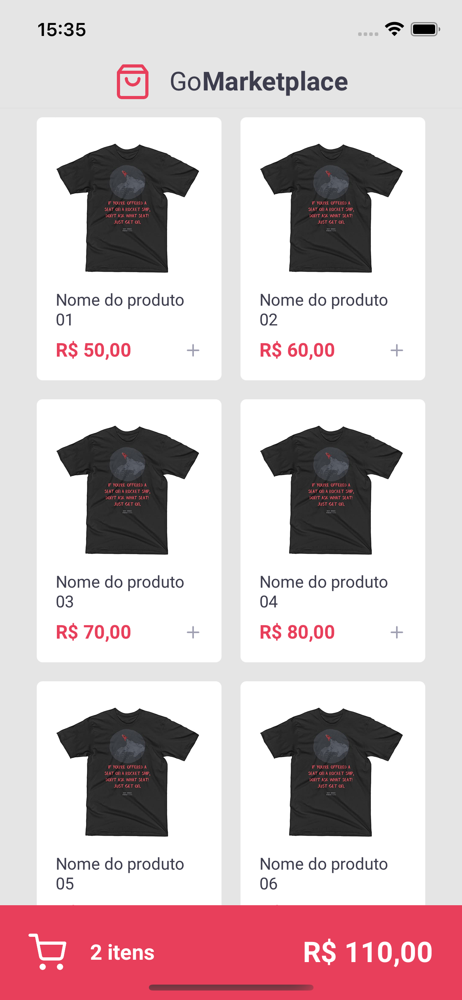

<p align="center">
   
</p>
<h4 align="center">
    <br><br>
    <p align="center">
      <a href="#-about">About</a>&nbsp;&nbsp;&nbsp;|&nbsp;&nbsp;&nbsp;
      <a href="###-content">Content</a>&nbsp;&nbsp;&nbsp;|&nbsp;&nbsp;&nbsp;
      <a href="#-technologies">Technologies</a>&nbsp;&nbsp;&nbsp;|&nbsp;&nbsp;&nbsp;
      <a href="#-how-to-run-the-project">Run</a>&nbsp;&nbsp;&nbsp;|&nbsp;&nbsp;&nbsp;
      <a href="#-info">Info</a>&nbsp;&nbsp;&nbsp;|&nbsp;&nbsp;&nbsp;
      <a href="#-changelog">Changelog</a>&nbsp;&nbsp;&nbsp;|&nbsp;&nbsp;&nbsp;
      <a href="#-license">License</a>
  </p>
</h4>

<h1 align="center">
    
  <div style="display: flex; flex-direction: row;">
    
    
  <div>
</h1>

## 🔖 About

O objetivo desse repositório é recriar o projeto [GoMarketplace](https://github.com/rocketseat-education/gostack-template-fundamentos-react-native) usando as novas versões do React Native e bibliotecas.

## 📌 Content
Este projeto é de estudo inicial dos conceitos do React Native, A principal função é se aprofundar o conhecimento em Redux.
O projeto é simular uma loja fictícia, consumindo informações de uma API Fake.
Storybook foi usado para mostrar os componentes do projeto.

## 🚀 Technologies

- [ReactNative](https://reactnative.dev/)
- [React Navigation](https://reactnavigation.org/)
- [Redux](https://redux.js.org/)
- [Styled Components](https://www.styled-components.com/)
- [Axios](https://axios-http.com/)
- [JsonServer](https://github.com/typicode/json-server)
- [Storybook](https://storybook.js.org/)

## 🏁 Run
#### Clone the repository
```bash
git clone https://github.com/rafinhaa/gomarketplace
cd gomarketplace
```

#### Install dependencies
```bash
yarn install
```

#### Start fake API
```bash
yarn server
```

#### Configure dotenv file
```bash
cp .env.example .env
vi .env
```

#### Start project
```bash
yarn run ios
```

## ℹ️ Info
### Development setup
Operating system: macOS 12.1 (Chip M1)

⚠️ Caso o projeto não mostre os produtos, rode antes de iniciar o jsonserver:
```bash
adb reverse tcp:3333 tcp:3333 
```

## 📄 Changelog

[See here](docs/changelog.md)

[MIT](LICENSE)

**Free Software, Hell Yeah!**